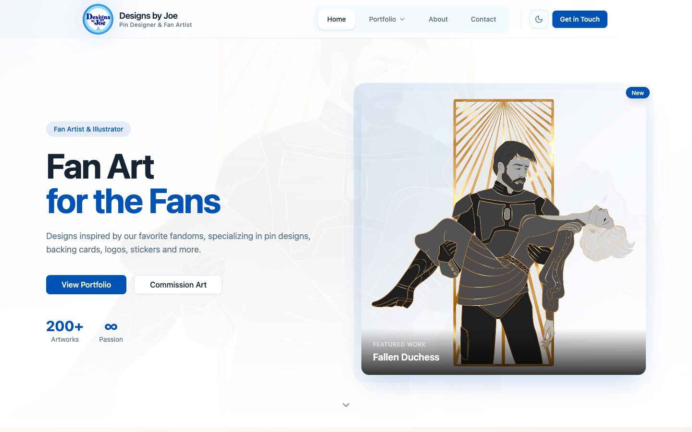
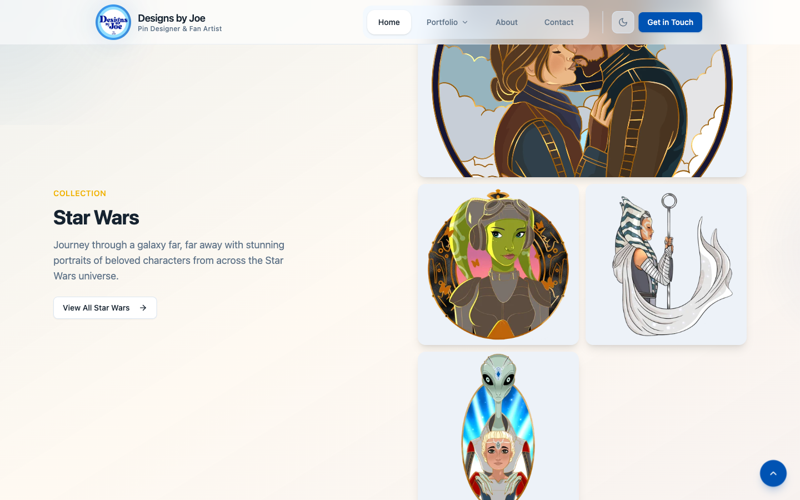
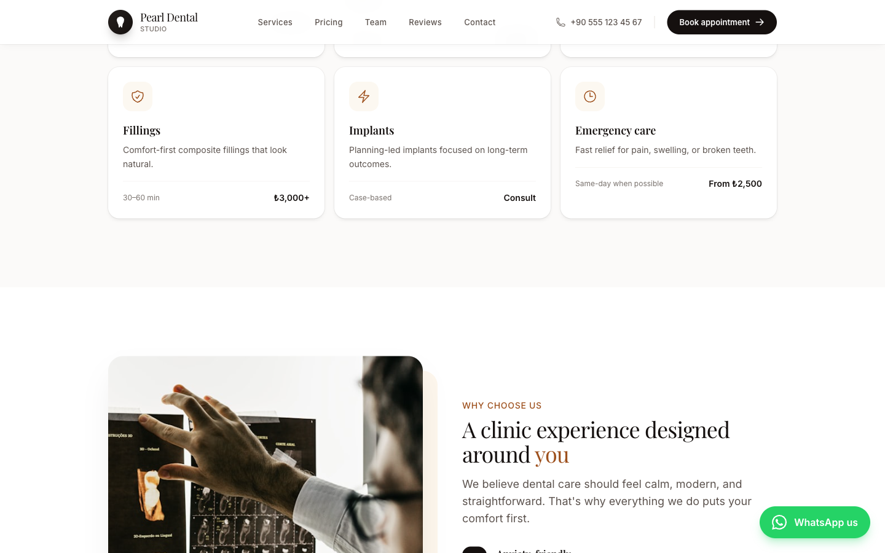
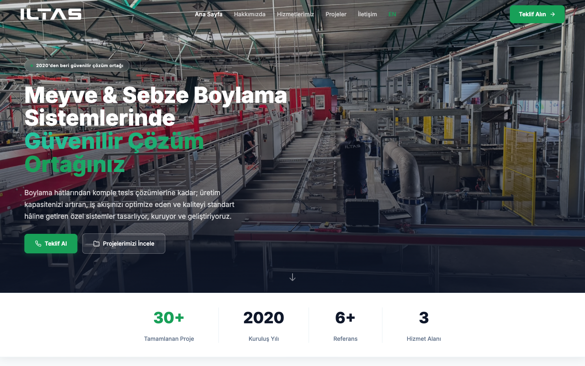
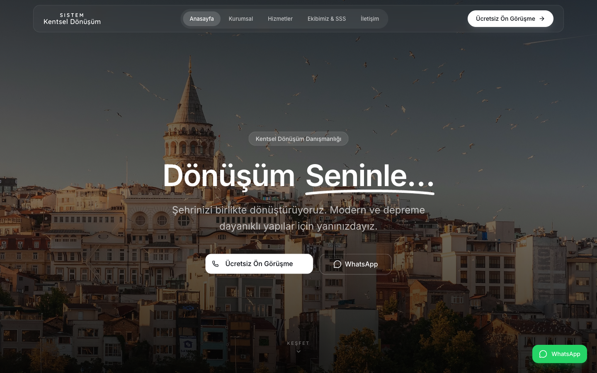

# Web Development Portfolio — 5 Production Websites

> All websites designed and developed solo using **SvelteKit 2, Svelte 5, TypeScript, and Tailwind CSS 4**

---

## 1. onurhaniffa.com — Personal Portfolio

> **Live:** [onurhaniffa.com](https://onurhaniffa.com) | **Source:** [github.com/OnurHaniffa/my-website](https://github.com/OnurHaniffa/my-website) (Public)

Personal developer portfolio showcasing projects and services with a premium, conversion-focused design.

**Key Features:**
- Custom SVG speedometer/gauge UI with clickable arc segments and curved text
- 10 different showcase component variants for portfolio display
- Directus 11 headless CMS with graceful fallback to static data
- Full English/Turkish internationalization with hreflang and bilingual sitemap
- Contact form with rate limiting, honeypot, XSS sanitization
- Motion One + GSAP animations with prefers-reduced-motion support
- OKLCH dark/light theme system
- Playwright performance tests
- **Ivory AI chatbot widget integrated** (see Ivory AI showcase)

---

## 2. designsbyjoe.net — Digital Illustrator Portfolio (Client)

> **Live:** [designsbyjoe.net](https://designsbyjoe.net) | **Source:** Private (Client)

Commission request platform for a professional digital illustrator specializing in fan art pin designs.

**Key Features:**
- Commission request form with Zod validation + sveltekit-superforms + Resend email
- Image gallery with lightbox (keyboard navigation, touch swipe, preloading)
- Multi-layered image protection (overlay, right-click block, blur on unfocus)
- Custom Sharp-based image optimization pipeline (PNG to WebP)
- 7 Playwright test files covering 5 device sizes
- Star Wars, Disney, Marvel, and Adorbs art collections

---

## 3. Pearl Dental Studio — Dental Clinic Template

> **Live:** [dentist-template-seven.vercel.app](https://dentist-template-seven.vercel.app) | **Source:** [github.com/OnurHaniffa/dentist-template](https://github.com/OnurHaniffa/dentist-template) (Public)

A production-ready dental clinic template with 7 pages, booking system, and full accessibility compliance.

**Key Features:**
- 7 pages: Home, Services, Pricing, Team, Reviews, Contact, Booking
- View Transitions API with graceful degradation
- WCAG AA: skip link, semantic HTML, ARIA roles, keyboard navigation, focus indicators
- JSON-LD Dentist schema with services, hours, and coordinates
- WhatsApp integration button
- Patient reviews and testimonials section
- Newsletter signup with email validation

---

## 4. iltasmakine.com — Agricultural Equipment Company (Client)

> **Live:** [iltasmakine.com](https://iltasmakine.com) | **Source:** Private (Client)

Full bilingual website for an agricultural fruit & vegetable sorting machinery company.

**Key Features:**
- Full Turkish/English bilingual site with separate route trees (/en/*)
- Contact form with Turkish phone validation and gibberish detection
- SEO debugging for real Google Search Console indexing issues
- Animated statistics counters (30+ projects, 6+ references) with requestAnimationFrame
- Project portfolio with image galleries
- Client trust bar with reference companies

---

## 5. sistemkentseldonusum.com — Urban Transformation Consulting (Client)

> **Live:** [sistemkentseldonusum.com](https://sistemkentseldonusum.com) | **Source:** Private (Client)

A 10-page website for an urban transformation consulting firm with KVKK (Turkish GDPR) compliance.

**Key Features:**
- 10 pages including KVKK (Turkish GDPR) compliance page
- Custom animation framework (Svelte action) with 8 animation types
- Contact API with XSS prevention
- WhatsApp business integration
- Service detail pages for legal support, architectural support, valuation, and process management
- Team profiles and FAQ section

---

## Common Tech Stack

All 5 websites share a modern, production-grade tech stack:

| Technology | Purpose |
|-----------|---------|
| SvelteKit 2 | Full-stack framework |
| Svelte 5 | Latest runes/signals API |
| TypeScript | Strict mode across all projects |
| Tailwind CSS 4 | Utility-first styling |
| Resend API | Transactional emails |
| Vercel | Deployment & hosting |
| JSON-LD | Structured data for SEO |
| WCAG AA | Accessibility compliance |

## Built By

**Onur Haniffa** — Full-Stack Developer & ML Engineer
[Portfolio](https://onurhaniffa.com) · [LinkedIn](https://linkedin.com/in/onurhaniffa) · [GitHub](https://github.com/OnurHaniffa)
