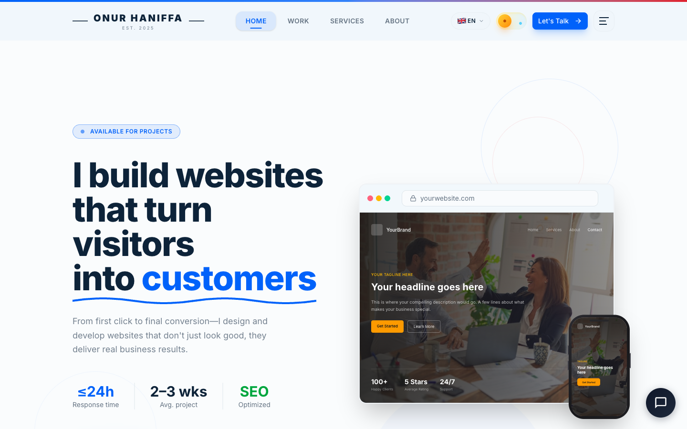
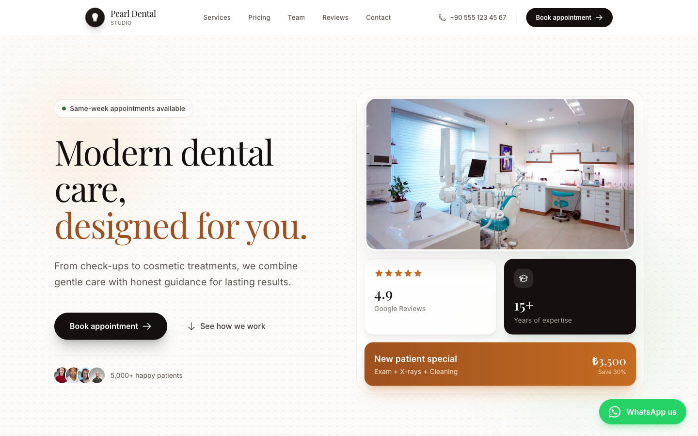
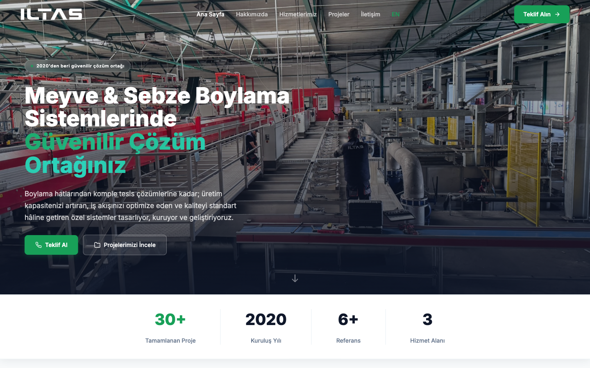

# Web Development Portfolio

> Production websites built and deployed for real clients across multiple industries. Every project built from scratch using modern web technologies.

---

## Projects

### 1. onurhaniffa.com — Personal Portfolio & Freelance Business

**Live:** [onurhaniffa.com](https://onurhaniffa.com) · **Source:** [GitHub (Public)](https://github.com/OnurHaniffa/my-website)

My personal portfolio and freelance business website. Not a template — built from scratch with custom components, animations, and a headless CMS integration.

**Key Features:**
- Custom SVG speedometer/gauge UI on the services page with clickable arc segments, gradient fills, and curved text
- 10 different showcase component variants (browser window, bento grid, live-demo iframe, 3D isometric, magazine editorial, etc.)
- Headless CMS (Directus 11) with graceful fallback to hardcoded data when unavailable
- Full internationalization (English + Turkish) with URL-based locale routing and hreflang tags
- Production contact form with Resend API, rate limiting (3 req/min), honeypot spam prevention, XSS sanitization
- Motion One + GSAP animation system with `prefers-reduced-motion` support
- Dark/light theme with OKLCH color system and Material Design elevation surfaces
- JSON-LD structured data (ProfessionalService, LocalBusiness, FAQPage, BreadcrumbList)
- Playwright performance tests (FCP, FPS, lazy-loading coverage)

**Tech:** SvelteKit 2 · Svelte 5 · TypeScript · Tailwind CSS 4 · Directus CMS · Motion One · GSAP · Resend · Vercel

---

### 2. Designs By Joe — Client Portfolio for Digital Illustrator

**Live:** [designsbyjoe.net](https://designs-by-joe-website.vercel.app)

Professional portfolio and commission request platform for a digital illustrator specializing in fan art enamel pin designs across Star Wars, Disney, Marvel, and "Adorbs" collections.

**Key Features:**
- Artwork gallery with category filtering via URL query parameters and bento-style responsive grid
- Full-screen lightbox with keyboard navigation (arrow keys), touch swipe support, and image preloading
- Commission request form with Zod schema validation, sveltekit-superforms, and Resend email delivery
- Multi-layered image protection system (overlay, right-click block, keyboard shortcut block, blur on window unfocus)
- Custom image optimization pipeline using Sharp (PNG→WebP, thumbnails at 400px, full at 1500px)
- Dark mode with oklch color palette
- Comprehensive Playwright test suite (7 test files covering 5 device sizes)
- PWA manifest for installability

**Tech:** SvelteKit 2 · Svelte 5 · TypeScript · Tailwind CSS 4 · shadcn-svelte · sveltekit-superforms · Zod · Sharp · Resend · Vercel

---

### 3. Pearl Dental Studio — Dental Clinic Website Template

**Live:** [Demo](https://dentist-template-seven.vercel.app) · **Source:** [GitHub (Public)](https://github.com/OnurHaniffa/dentist-template)

Production-ready dental clinic website template with appointment booking, service listings, team profiles, reviews, and transparent pricing.

**Key Features:**
- 7 pages: Home, Services, Pricing, Team, Reviews, Contact, Booking
- Full booking form with client-side validation, loading/success states, service selection with price hints
- Page transitions using the View Transitions API with graceful degradation
- Scroll-triggered fade-in animations via IntersectionObserver with `prefers-reduced-motion` support
- Button component: 4 variants, 3 sizes, icon slots, loading state, polymorphic rendering (`<a>` or `<button>`)
- WCAG AA accessibility: skip link, semantic HTML, proper heading hierarchy, ARIA roles, keyboard navigation, focus indicators
- JSON-LD `Dentist` schema with services, hours, geo coordinates, aggregate rating
- Programmatic sitemap.xml and robots.txt

**Tech:** SvelteKit 2 · Svelte 5 · TypeScript · Tailwind CSS 4 · oklch colors · Vite 7 · Vercel

---

### 4. ILTAS Machinery — Bilingual Corporate Site

**Live:** [iltasmakine.com](https://iltas-website.vercel.app)

Bilingual (Turkish/English) corporate website for an agricultural machinery company specializing in fruit and vegetable grading systems.

**Key Features:**
- Full internationalization with separate route trees (`/` Turkish, `/en` English), hreflang alternate links
- Server-side contact form with robust validation (phone format, gibberish detection, word count, name validation)
- Animated statistics counters using `requestAnimationFrame` with cubic ease-out easing
- Scroll-triggered section animations with IntersectionObserver
- Iterative SEO debugging for real Google Search Console issues (soft 404s, duplicate content, redirect chains)
- Beautifully templated HTML emails via Resend API

**Tech:** SvelteKit 2 · Svelte 5 · TypeScript · Tailwind CSS 4 · bits-ui · Resend · Vercel

---

### 5. Sistem Kentsel Donusum — Urban Transformation Consulting

**Live:** [sistemkentseldonusum.com](https://sistem-kentsel-donusum.vercel.app)

10-page corporate website for an urban transformation consulting company in Turkey, complete with legal compliance pages and print marketing collateral.

**Key Features:**
- Custom animation framework (Svelte action) with 8 animation types, configurable delay/duration/threshold, and stagger utility
- 10 pages including KVKK (Turkish GDPR), Privacy Policy, Terms of Use — full regulatory compliance
- REST-style contact API with XSS prevention via HTML escaping
- Print brochure generation pipeline (HTML→PDF via Puppeteer)
- Reusable SEO component accepting title, description, canonical, ogImage, ogType, noindex props
- WhatsApp integration with pre-filled Turkish messages
- shadcn-svelte components (accordion, badge, button, card, input, textarea, sonner)

**Tech:** SvelteKit 2 · Svelte 5 · TypeScript · Tailwind CSS 4 · shadcn-svelte · Puppeteer · Resend · Vercel

---

## Common Tech Stack

Every project shares a modern, consistent technology foundation:

| Layer | Technology |
|---|---|
| **Framework** | SvelteKit 2 with Svelte 5 (latest runes syntax) |
| **Language** | TypeScript (strict mode) |
| **Styling** | Tailwind CSS 4 with oklch perceptual color system |
| **Email** | Resend API |
| **Deployment** | Vercel |
| **SEO** | JSON-LD structured data, Open Graph, Twitter Cards, programmatic sitemaps |
| **Accessibility** | WCAG AA, semantic HTML, keyboard navigation, reduced-motion support |

---

## Development Approach

- **No templates** — Every site designed and built from scratch
- **Mobile-first** — Responsive across all device sizes
- **Performance-first** — Lazy loading, optimized images, minimal JavaScript
- **Security-conscious** — XSS prevention, input validation, secure environment variables
- **SEO-optimized** — Structured data, canonical URLs, sitemaps, meta tags
- **Accessibility-compliant** — WCAG AA, keyboard navigation, ARIA roles

---

## Contact

**Onur Haniffa** — [onurhaniffa.com](https://onurhaniffa.com) · [LinkedIn](https://www.linkedin.com/in/onurhaniffa/)
